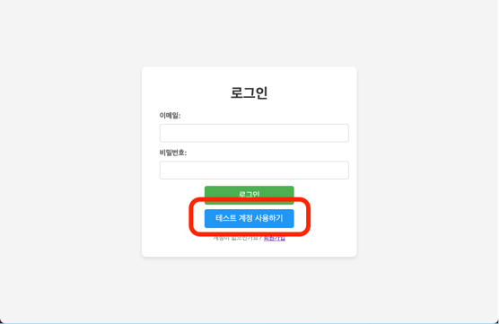
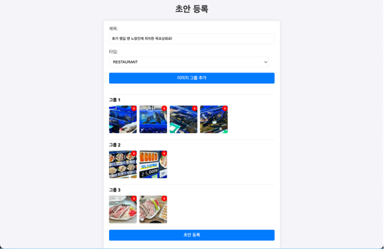
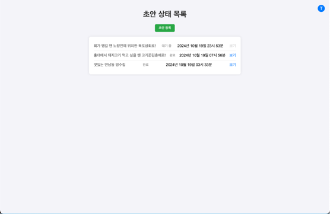
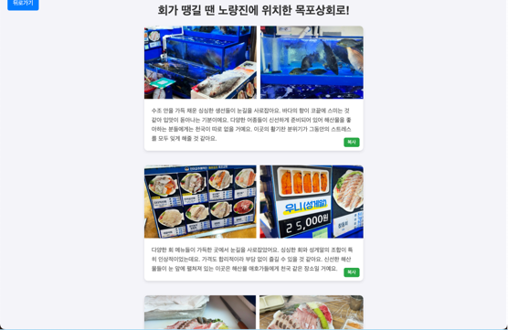

22222

## 소개

꽤 많은 직장인들이 소비를 줄이기 위해 네이버 블로그, 인스타그램과 같은 SNS를 활용해서 소량의 외식비를 지원받는 절약 생활을 하고 있습니다.
하지만 자신의 SNS 메인 주제가 맛집이 아님에도 외식비 지원을 위해 맛집 후기를 작성하는 것이 여간 쉬운 일은 아닙니다.
이런 글을 일주일에 적게는 1개 많게는 2 ~ 3개의 글을 작성해야 하고, 한 달이면 최대 10 ~ 15개의 맛집 후기를 작성해야합니다.

[AI Blog Draft](https://aiblog.mochayoo.site/)는 단순한 블로그 글 반복 작성을 도와드리기 위해 개발된 **사진 기반 초안 작성 애플리케이션**입니다.

블로그 협찬을 받고 있는 분들 중 반복되는 후기 작성에 지친 분들이 계시다면 [AI Blog Draft](https://aiblog.mochayoo.site/)를 방문하여 서비스를 이용해보세요.

 

## 기능

### 1. 테스트 계정

신규 가입 전, 테스트 계정을 통해 로그인하여 기존에 생성된 초안들을 둘러볼 수 있습니다.

또한 초안 등록을 실제로 사용해 볼 수도 있습니다.

### 2. 초안 등록

제목을 작성하고 타입을 선택합니다.
현재 타입은 `RESTAURANT` 하나이며, 추가 확장 계획입니다.

`이미지 그룹 추가`를 통해 문단별로 등록할 사진을 묶어서 선택해줌으로써 이미지 그룹을 생성합니다.
초안은 그룹별로 3줄 ~ 5줄로 생성됩니다.

제거하고 싶은 이미지가 있다면 등록 전, 사진 우측 상단의 `x`버튼을 통해 삭제할 수 있습니다.
모든 이미지가 제거된 그룹은 자동으로 제거됩니다.

등록한 초안은 생성까지 1분~3분정도 소요됩니다.

대기 중인 초안은 `보기` 버튼이 비활성화 상태이며, 생성이 완료되면 `보기` 버튼이 활성화되어 초안 상세 페이지로 이동할 수 있습니다.

### 3. 초안 확인

`보기` 버튼을 통해 초안 상세 페이지로 이동했다면 생성된 초안을 참고하여 블로그 작성을 진행합니다.

이미지 그룹별 초안은 그룹 하단 우측의 복사 버튼을 통해 간편하게 복사해 이용할 수 있습니다.
